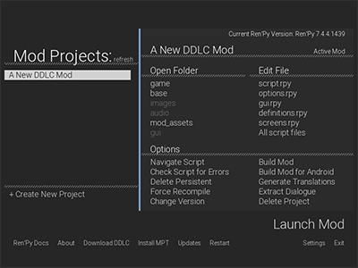

## Doki Doki Mod Maker (DDMM/DDMMaker)

Doki Doki Mod Maker is a mod maker for the visual novel "Doki Doki Literature Club" that allows modders to make their mods easier and simpler with a re-written Ren'Py Source Distribution Kit (SDK).
> This project is unafilliated with either Team Salvato or RenpyTom. See the [disclaimer](https://ganstakingofsa.github.io/information/disclaimer/disclaimer.html) page for more information.

Download Doki Doki Mod Maker for Ren'Py 6 by clicking the 1st *ZIP* button.

Download Doki Doki Mod Maker for Ren'Py 7 by clicking the 2nd *ZIP* button.

Download Doki Doki Mod Maker for Ren'Py 8 by clicking the 3rd *ZIP* button.

## Features
1. Auto mod template installation
2. Auto tool installation [Beta]
3. Atom (for DDMM/DDMMaker running Ren'Py 6)
4. Support for MacOS, Linux and Android
5. Dark Mode
6. Updates (Ren'Py 7/8 Only) [Beta]

## Screenshots

## Changes

Version 1.5.0 - Astute Voyage Part II
- Ren'Py 8 Mod Build Support
- Fixed a bug relating to renpy-version.txt
- Changed mod maker for MacOS
   > MacOS versions require `ddlc-win.zip` or `DDLC-1.1.1-pc` folders than their mac counterparts.
- Changed tool install method
- New Updater for DDMM 7/8
